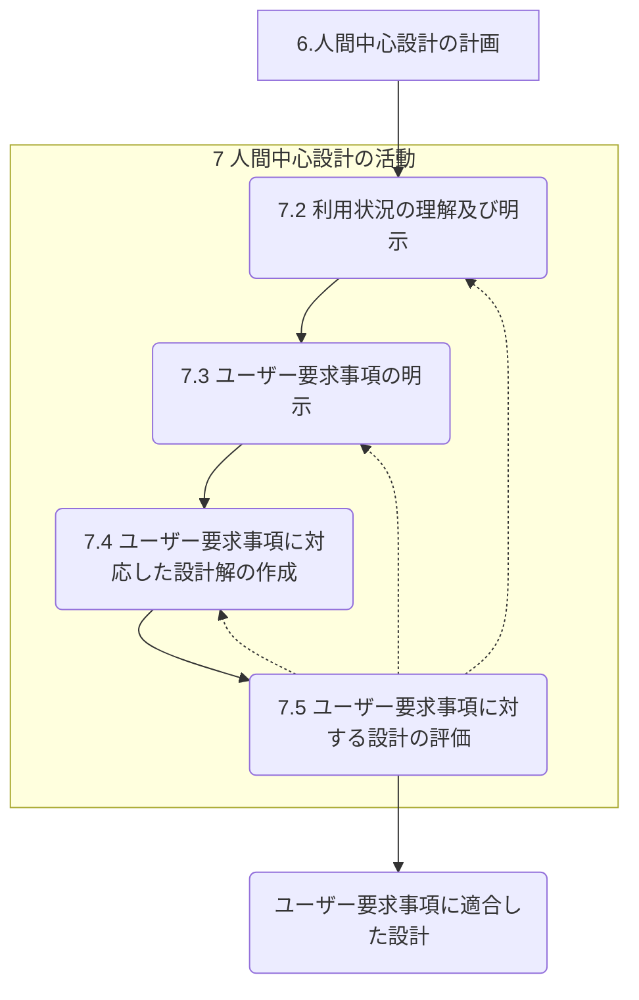

# iso9241-210-2019-figure1
9241-210:2019 Figure1 - Interdependence of human-centred design activities

```mermaid
flowchart TD;
    6[6.人間中心設計の計画]-->7.2
    subgraph 7 人間中心設計の活動
        7.2(7.2 利用状況の理解及び明示)
        -->7.3(7.3 ユーザー要求事項の明示);
        7.3-->7.4(7.4 ユーザー要求事項に対応した設計解の作成);
        7.4-->7.5(7.5 ユーザー要求事項に対する設計の評価);
        7.5-.->7.2;
        7.5-.->7.3;
        7.5-.->7.4;
    end
    7.5-->E(ユーザー要求事項に適合した設計);
```
